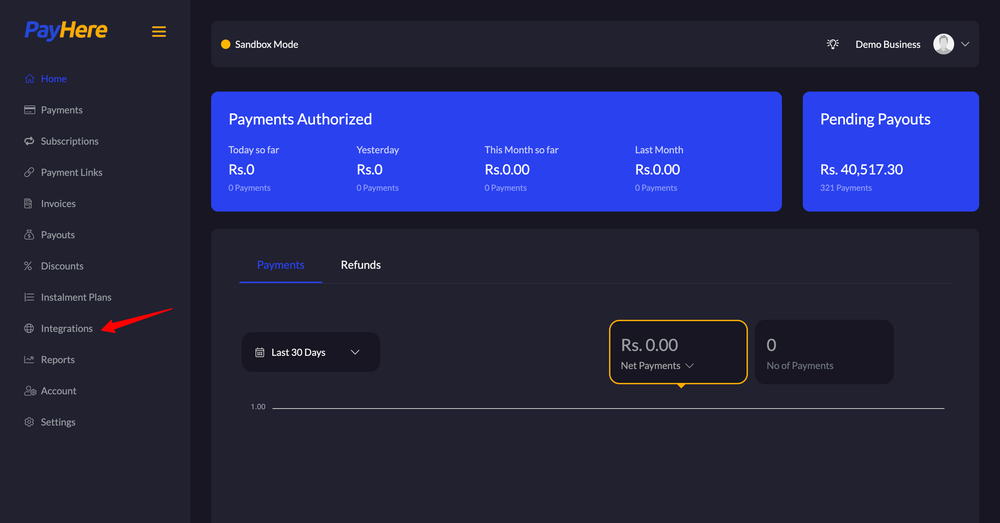
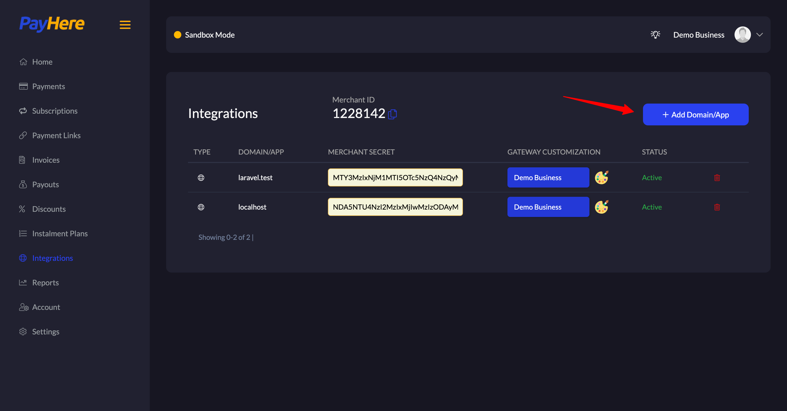
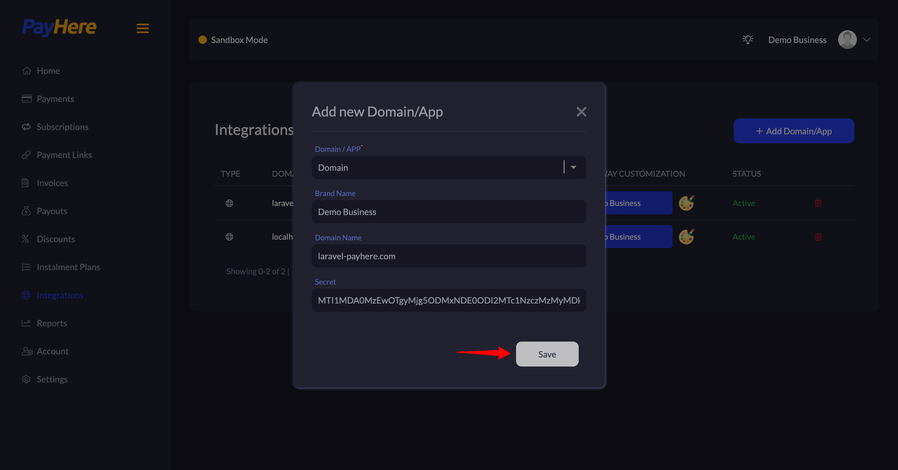
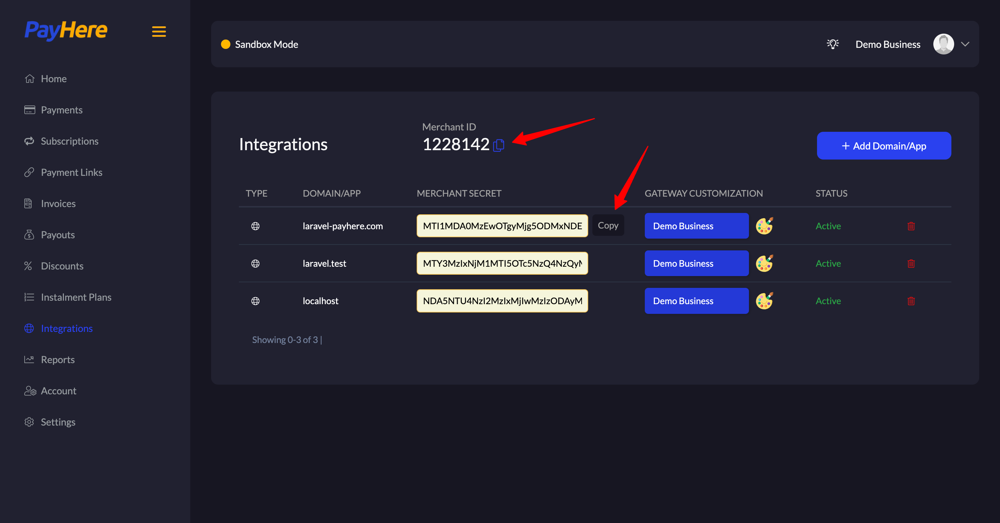
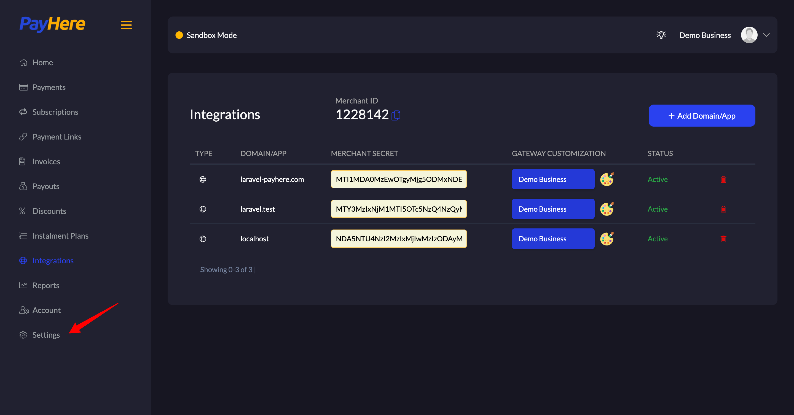
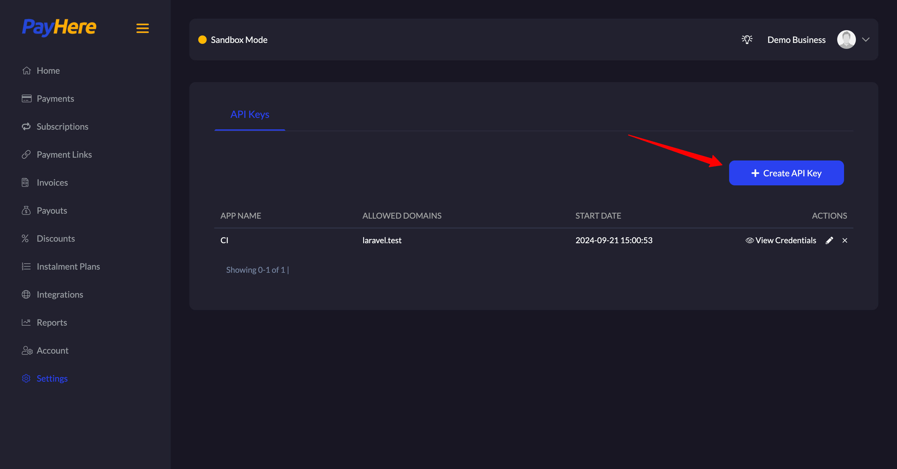
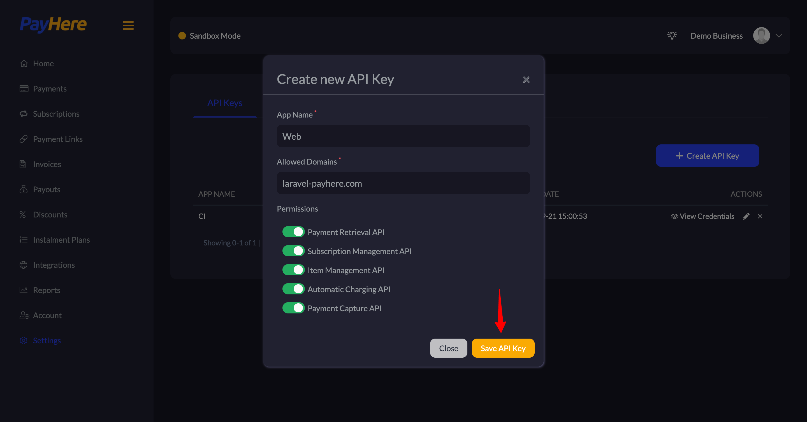
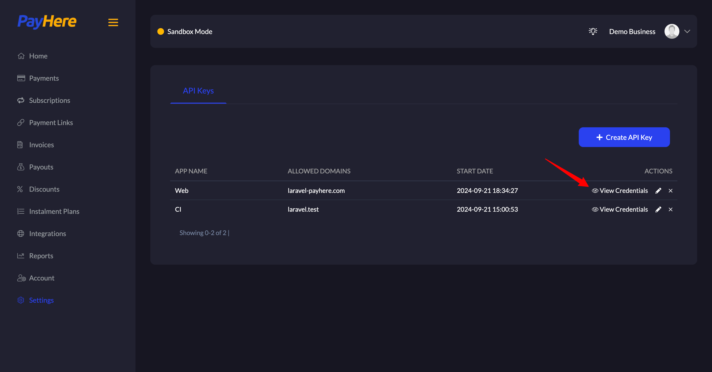
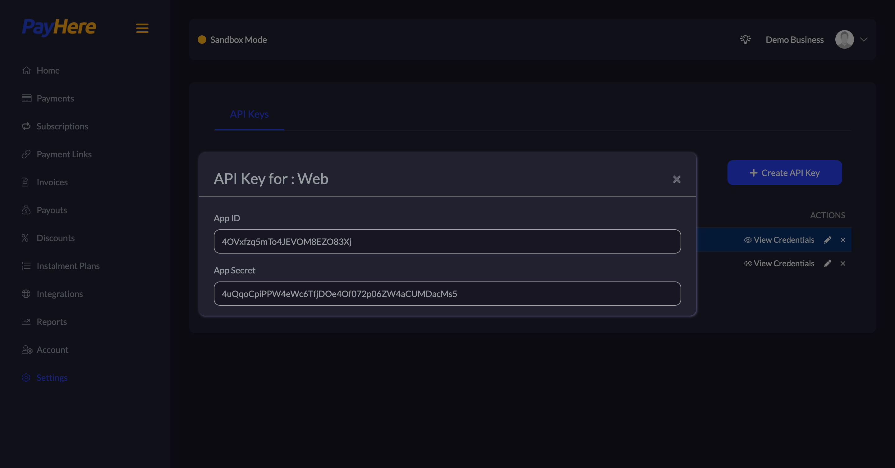

# API Keys

To use Laravel PayHere, you should configure your PayHere API keys in your application's `.env` file. You can retrieve these API keys from the PayHere portal.

```dotenv
PAYHERE_MERCHANT_ID=your-payhere-merchant-id
PAYHERE_MERCHANT_SECRET=-your-payhere-merchant-secret
PAYHERE_APP_ID=your-payhere-app-id
PAYHERE_APP_SECRET=your-payhere-app-secret
PAYHERE_SANDBOX=true
```

You should set the `PAYHERE_SANDBOX` environment variable to true when using [PayHere's Sandbox environment](https://sandbox.payhere.lk). When deploying your application to production, you can either set it to `false` or leave it out.

## Retrieve API Keys from PayHere

1. Sign in to your PayHere [live](https://payhere.lk/) or [sandbox](https://support.payhere.lk/) account.

2. Click on the "Integrations" in the sidebar.
   

3. Click on the "Add Domain\App" button.
   

4. Fill the form and click on "Save".
   

5. Copy the "Merchant ID" and "Merchant Secret" paste them into your `.env` file.
   

6. Click on the "Settings" in the sidebar.
   

7. Click on the "Create API Key" button.
   

8. Fill the form and click on "Save API Key" button.
   

9. Click on the "View Credentials" link.
   

10. Copy the "App ID" and "App Secret" paste them into your `.env` file.
    
